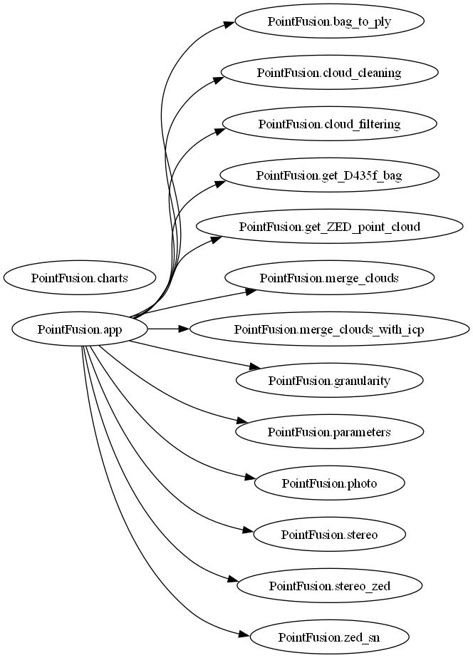
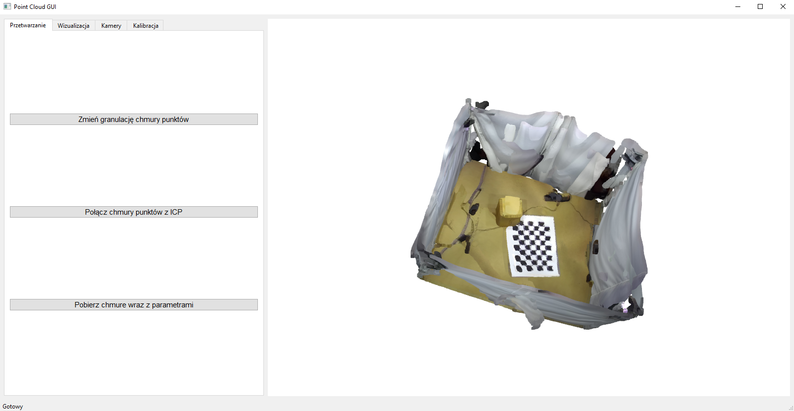

# PointFusion Application

PointFusion is a comprehensive tool designed for processing, analyzing, and visualizing 3D point clouds generated by Stereolabs ZED 2 and Intel RealSense D435f cameras. The goal of this project was to develop, implement, and validate a multi-camera system based on RGB-D cameras, enabling precise 3D spatial modeling.

## Application Objective

The primary objective of this project was to create, implement, and verify a multi-camera system, named PointFusion, utilizing three Intel RealSense D435f cameras and three Stereolabs ZED 2 cameras. The system aims to provide high-precision 3D spatial modeling, making it suitable for applications requiring accurate spatial analysis, such as robotics, reverse engineering, and creating digital representations of real-world environments.

PointFusion generates and merges high-quality point clouds, maintaining detail and accuracy. Users can adjust the granularity of point clouds to suit specific application needs. This flexibility is complemented by an intuitive user interface, making the tool versatile for 3D data analysis.

To better understand the system's architecture, Figure 1 illustrates the relationships between its modules. The central module, `PointFusion.app`, serves as the primary coordinator, integrating all point cloud processing functionalities while managing data from various sensors and optimizing results.

*Figure 1: Project Structure Overview*

## Key Features

PointFusion offers an extensive set of features for working with point clouds, all accessible through an intuitive interface. Below are the core functionalities:

- **Data Conversion:**  
  Supports importing `.bag` files and converting them to the `.ply` format automatically using advanced vision data processing tools.

- **Point Cloud Fusion:**  
  Integrates spatial data from multiple sources using algorithms like ICP and RANSAC, enabling the creation of unified point clouds.

- **Granularity Adjustment:**  
  Allows users to modify the resolution of point clouds by changing voxel sizes, optimizing processing performance for high-density data.

- **Point Cloud Visualization:**  
  Provides an interactive 3D window to load, display, and analyze point clouds, facilitating result verification.

- **Stereo Camera Calibration:**  
  Enables precise calibration of external parameters for selected camera pairs, essential for achieving high accuracy in multi-camera setups.

*Figure 2: Main Application Window*

## Technologies Used

PointFusion leverages the following libraries and technologies for efficient point cloud processing, visualization, and analysis:

- **Open3D:** For handling 3D data, including point clouds and 3D meshes.
- **PySide6:** For building an intuitive graphical user interface.
- **OpenCV-Python:** For image processing and computer vision tasks.
- **NumPy:** For numerical computations and large dataset operations.
- **PyZED:** For integrating and controlling Stereolabs ZED cameras.
- **PyRealSense2:** For managing Intel RealSense cameras and working with depth data.
- **Matplotlib:** For visualizing data in plots and charts.

## Application Workflow

The application guides users through each stage of 3D data processing, from camera calibration to advanced point cloud operations:

1. **Stereo Calibration:**  
   Accurately aligns external parameters of camera pairs. For RealSense cameras, intrinsic parameters are extracted from `.bag` files.

2. **Data Preparation:**  
   RealSense camera data is extracted from `.bag` files and converted to `.ply` format. This data is then processed into point clouds for further analysis.

## Point Cloud Processing

After data preparation, the user can process point clouds through the following steps:

- **Point Cloud Merging:**  
  ZED camera data is processed using RANSAC and ICP algorithms, focusing on key spatial elements to create a cohesive 3D model. For RealSense cameras, transformations based on rotation matrices \( R \) and translation vectors \( T \) from calibration are used.

- **Granularity Adjustment:**  
  Reduces point density while retaining structural integrity through voxel downsampling, improving processing efficiency for large datasets.

- **Noise Removal:**  
  Enhances point cloud quality by eliminating isolated points using a neighbor-distance-based algorithm, adjustable through the interface.

- **Visualization:**  
  Provides an interactive 3D space for exploring and analyzing point clouds, including rotation, zoom, and detailed inspection.

Users can save results at any stage in `.ply` format for further use in external tools.

## Summary

PointFusion is a robust, versatile tool for working with 3D point clouds, offering intuitive operation through a PySide6-based GUI. Its compatibility with popular data formats like `.bag` and `.ply` makes it accessible even to users with limited 3D data experience. The application supports comparisons between camera setups, enabling tailored solutions for diverse user requirements.

### Future Developments

Potential future enhancements include optimizing fusion algorithms for performance, expanding GUI functionality, and integrating additional sensors to improve accuracy and reliability under various conditions and applications.
